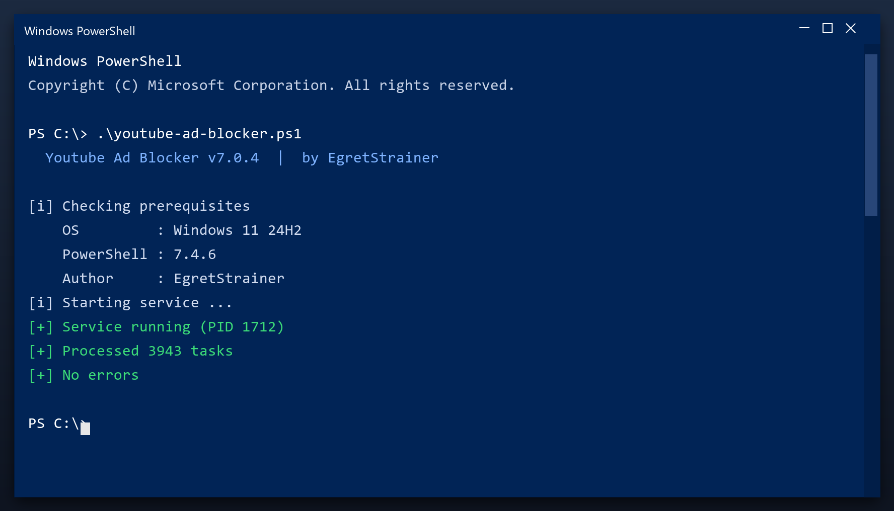

# Download Youtube Ad Blocker for Free — Latest 2026 Version

 

If your PC feels slower than it used to, **youtube ad blocker** is the fix. It clears the clutter that builds up over months of use and restores the speed you had on day one. Current 2026 build for Windows 10 and 11.

| | |
| --- | --- |
| **Program** | Youtube Ad Blocker |
| **Version** | Latest 2026 build |
| **Price** | Free |
| **Systems** | see requirements below |
| **Download** | Quick Start section below |

  

## Before You Start

- Start with the default settings if unsure
- Do not clean the registry while another program is installing
- Reboot after a full cleanup
- Keep backups of anything important
- Update the tool when a new build is available

## Requirements

| **Component** | **Minimum** | **Notes** |
| --- | --- | --- |
| **Windows** | 10 (64-bit) | 11 fully supported |
| **RAM** | 2 GB | 4 GB for large scans |
| **Disk** | 100 MB | Plus space to clean |
| **Account** | Standard | Admin for full cleanup |

## Install

1. **Download** and unzip the package
2. **Right-click** the program and choose Run as administrator
3. **Choose a scan type** (quick or deep)
4. **Wait** for the report
5. **Select** the items to remove and confirm

  

> **Note:** run the tool as administrator so it can clean system folders. Without admin rights it will only touch your own user files.

## What It Does

Youtube ad blocker does three things: it finds junk files, it finds broken settings, and it removes them. That is the whole tool - no social features, no accounts, no ads. It runs as a normal Windows program and works fully offline after you download it.

| **Term** | **Meaning** |
| --- | --- |
| **Junk** | Files no program needs any more |
| **Broken entry** | A setting that points to nothing |
| **Cache** | Temporary data stored for speed |
| **Offline** | Works without an internet connection |

## Features

| **Feature** | **Details** |
| --- | --- |
| **Size** | Small download, quick install |
| **Scan speed** | Typically under 3 minutes |
| **Background use** | None when closed |
| **Ads** | None |
| **Bundled extras** | None |
| **Offline** | Works without internet |

## Problems and Fixes

| **Issue** | **Fix** |
| --- | --- |
| **Windows warns about the file** | Click More info, then Run anyway |
| **Slow first launch** | Normal - it indexes on first run |
| **Scan finds nothing** | Good - your PC is already clean |
| **Settings do not save** | Run as admin once so it can write config |

## FAQ

**Is admin access required?**

For a full cleanup, yes. Without it the tool only cleans your user folders.

**Will it fix my registry?**

It can scan and repair broken entries, and it backs up before changing anything.

**Does it work offline?**

Yes - once downloaded it needs no internet connection.

**How much space will I save?**

It varies, but most PCs recover several gigabytes on the first run.

---

*gentle-aurora-490 · Updated 2026-10-11 · Shared under the MIT License*
